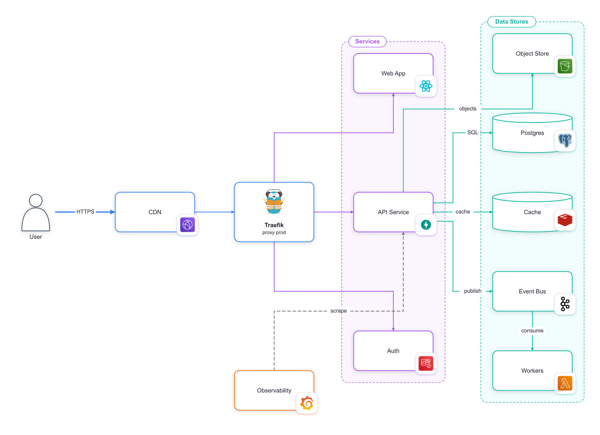

# Épure

> The architecture-diagram editor for the Claude Code era — your diagram lives in
> your repo as a reviewable file pair, and Claude Code edits it live while you watch.

[](./LICENSE)



Épure is a grid-snapped, orthogonal-routed architecture-diagram editor. A diagram
is **two small text files** — semantic D2 for the topology, a JSON sidecar for the
visuals — so it diffs in a pull request like code, with no SaaS, no account, no
lock-in. It is built to be driven by **Claude Code**: CC writes the files, you
watch them render live, you drop comments on the canvas, and CC addresses them.

## Install

Épure ships as a single CLI. Install it from this repo (it self-builds on
install — no npm account needed):

```sh
npm i -g github:theodo-group/epure
```

This gives you the `epure` command. (Prefer not to install globally? Every
command below also works as `npx github:theodo-group/epure …`.)

## Quickstart (with Claude Code)

```sh
epure skill install      # teach Claude Code the Épure workflow (one time)
```

Then just ask Claude Code, in any repo:

> "Diagram this service's architecture with epure."

Claude Code will create the `.epr.d2` + `.epr.layout.json` pair, open the live
editor in your browser, and refine the diagram as you discuss it. While it works:

- **Watch it build live** — every edit CC makes to the files appears instantly.
- **Tweak by hand** — drag nodes, restyle; your changes are written back to the
  files (and into the next `git diff`).
- **Comment on it** — toggle 💬 **Comment**, drop pins on the diagram, then
  **Send to Claude** to have CC address them and mark each resolved.
- CC can **see the result** too — it renders a PNG (`epure export`) to check its
  own work and discuss the visuals with you.

## Quickstart (just the editor)

```sh
epure ./docs/diagrams/system.epr.d2   # creates the pair if missing, opens the live editor
```

That prints a local URL and serves the editor against that file pair, syncing both
directions. Nothing leaves your machine.

## The `epure` CLI

| Command | What it does |
|---|---|
| `epure <file>` | Serve the live editor for a diagram pair (creates a seed if missing). |
| `epure new <file>` | Scaffold a new pair (won't overwrite an existing one). |
| `epure export <file> -o out.png` | Render a fit-to-content PNG — no browser needed. |
| `epure validate <file\|dir>` | Parse + schema + cross-file checks; non-zero exit on problems. |
| `epure fmt <file>` | Canonicalize the layout JSON so diffs stay minimal. |
| `epure skill install` | Install the `epure-diagram` skill into `~/.claude/skills`. |

## The file format

A diagram is a pair of files sharing a basename, committed and reviewed together.

```d2
# system.epr.d2  — topology (the source of truth)
api: API { shape: rectangle }
db: Postgres { shape: cylinder }
api -> db: "writes"

# groups list member ids (no `shape:`):
Backend: "Backend" {
  api
  db
}
```

```json
// system.epr.layout.json  — visuals (all geometry in integer grid units)
{
  "gridSize": 40,
  "nodes": {
    "api": { "cx": 8, "cy": 4, "w": 4, "h": 2, "borderColor": "purple" },
    "db":  { "cx": 16, "cy": 4, "w": 4, "h": 2, "borderColor": "teal" }
  },
  "edges": {
    "api->db": { "color": "teal", "lineStyle": "dashed", "sourceSide": "E", "targetSide": "W" }
  },
  "areas": {
    "Backend": { "borderColor": "purple", "fillColor": "purple" }
  }
}
```

The `.epr.d2` owns topology (nodes, shapes, edges, labels, group membership). The
`.epr.layout.json` sidecar owns each node's **center** `cx,cy` and size `w,h` (in
grid units), the grid pitch, per-element styling, area styling (keyed by area id —
membership stays in the `.d2`), and each edge's preferred anchor side. The full
canonical example is [`fixtures/system.epr.*`](./fixtures); the schema lives in
[`src/file/layoutSchema.ts`](./src/file/layoutSchema.ts).

Keeping diagrams in a repo? Drop this into its `CLAUDE.md`:

```md
## Architecture diagrams (Épure)
Diagrams live as `<name>.epr.d2` + `<name>.epr.layout.json` pairs under `docs/diagrams/`.
- At session start, run `epure <file>.epr.d2 &` (idempotent) and share the URL.
- Edit the pair directly; saves sync live to the open editor.
- Render `epure export <file>.epr.d2 -o /tmp/x.png` to see the result.
- Run `epure validate <file>.epr.d2` before finishing; tidy with `epure fmt`.
```

## Icons

Any node may carry an official cloud / infra / tech logo from the
[mingrammer/diagrams](https://github.com/mingrammer/diagrams) set. The reference
lives in the JSON sidecar (never the D2), keyed `<provider>/<category>/<name>`:

```json
"api": { "cx": 8, "cy": 4, "w": 4, "h": 2, "icon": "programming/framework/fastapi" }
```

In the editor, select a node and use the **Icon** control (searchable, by
provider). Logos are inlined as data URIs on export, so PNG / HTML stay
self-contained.

## How it works

- **Parser** — a Chevrotain grammar for a tiny, safe D2 subset (nodes, edges,
  one-level groups; nested containers / globs / `near` are rejected).
- **Layout** — you place the boxes; [libavoid](https://www.adaptagrams.org/)
  routes orthogonal edges *around* them.
- **Editor** — React + Vite SPA (CodeMirror + SVG canvas, Zustand + zundo undo).
  A static build; the same bundle runs on a static host and behind the live bridge.
- **Bridge** — a tiny local server (chokidar + ws + sirv) that watches the pair
  and syncs the browser both ways, with semantic echo-suppression so edits never
  loop. Ships only in the CLI; never in the static bundle.

## Develop

```sh
pnpm install
pnpm dev          # the editor against a fixture
pnpm typecheck    # tsc across the project
pnpm lint         # ESLint (flat config)
pnpm test         # Vitest
pnpm build        # static SPA into dist/
pnpm build:server # bundle the CLI/server into dist-server/
```

Requires Node 20+ and pnpm 9+.

## License

MIT — see [LICENSE](./LICENSE).
